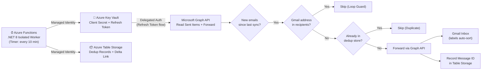

# Outlook → Gmail Outbound Mail Sync

An Azure Functions service (.NET 8 Isolated Worker) that syncs outbound emails sent from `murragh2@outlook.com` over to `murragh2@gmail.com` every 10 minutes.

This allows you to continue using Outlook as your primary sender identity while having your sent emails accessible in Gmail for intelligence/Gemini processing.

---

## Features

- **Timer Triggered**: Runs every 10 minutes (configurable via CRON schedule).
- **Delta Query Sync**: Uses Microsoft Graph API delta queries (`/me/mailFolders/SentItems/messages/delta`) to efficiently fetch only newly sent emails.
- **Two-Layer Deduplication**: Tracks processed `internetMessageId` values in Azure Table Storage to guarantee no message is forwarded more than once.
- **Infinite Loop Safeguard**: Automatically skips messages where `murragh2@gmail.com` is in the recipient list (`To`, `Cc`, `Bcc`), preventing endless forwarding loops when Graph places forwarded messages back into `Sent Items`.
- **OAuth Delegated Auth with Token Auto-Rotation**: Stores the OAuth refresh token in Azure Key Vault and continuously rotates it on each sync execution.
- **Passwordless Azure Infrastructure**: Uses System-Assigned Managed Identity (`DefaultAzureCredential`) for passwordless access to Azure Key Vault and Azure Table Storage.
- **Bicep Infrastructure-as-Code**: Includes complete Bicep templates for provisioning Function App, Key Vault, Storage Account, and RBAC role assignments.
- **GitHub Actions CI/CD**: Includes workflows for PR validation and automated deployment via OIDC federated credentials.

---

## Architecture Overview



---

## Prerequisites

1. **Microsoft Entra ID App Registration**:
   - Supported account types: **Personal Microsoft accounts only** (or "Personal + organizational").
   - Delegated Permissions: `Mail.Read`, `Mail.Send`, `offline_access`.
   - Client Secret created.
   - Redirect URI: `http://localhost:8400` (for the CLI auth tool).

2. **Azure Subscription**:
   - Azure CLI (`az`) installed and authenticated via `az login`.

3. **.NET 8 SDK** installed locally.

---

## Project Structure

```
outlook-gmail-outbound-sync/
├── src/
│   ├── OutlookGmailSync/                # Azure Functions Timer App (.NET 8)
│   └── OutlookGmailSync.AuthCli/        # One-time interactive auth tool
├── tests/
│   └── OutlookGmailSync.Tests/          # Unit tests (xUnit + Moq)
├── infra/                               # Infrastructure-as-Code (Bicep)
│   ├── main.bicep
│   ├── main.bicepparam
│   └── modules/
│       ├── functionApp.bicep
│       ├── storage.bicep
│       ├── keyVault.bicep
│       └── rbac.bicep
└── .github/
    └── workflows/
        ├── ci.yml                       # Build & Test on PR
        └── deploy.yml                   # Deploy to Azure on push to main
```

---

## Initial Setup & Deployment

### Step 1: Provision Azure Resources via Bicep

```bash
# Create resource group
az group create --name rg-outlook-gmail-sync --location eastus2

# Deploy infrastructure
az deployment group create \
  --resource-group rg-outlook-gmail-sync \
  --template-file infra/main.bicep \
  --parameters entraClientId="<YOUR_ENTRA_APP_CLIENT_ID>"
```

### Step 2: Store Initial Client Secret in Key Vault

```bash
az keyvault secret set \
  --vault-name kv-ogms \
  --name GraphClientSecret \
  --value "<YOUR_ENTRA_APP_CLIENT_SECRET>"
```

### Step 3: Perform One-Time OAuth Authentication

Run the `OutlookGmailSync.AuthCli` tool to sign into your `murragh2@outlook.com` account and generate the initial refresh token in Key Vault:

```bash
dotnet run --project src/OutlookGmailSync.AuthCli/OutlookGmailSync.AuthCli.csproj -- \
  --vault-uri "https://kv-ogms.vault.azure.net" \
  --client-id "<YOUR_ENTRA_APP_CLIENT_ID>"
```

Follow the browser prompt to log in and grant permissions. The tool will save the initial `GraphRefreshToken` secret to Key Vault.

---

## Local Development

Edit `src/OutlookGmailSync/local.settings.json`:

```json
{
  "IsEncrypted": false,
  "Values": {
    "AzureWebJobsStorage": "UseDevelopmentStorage=true",
    "FUNCTIONS_WORKER_RUNTIME": "dotnet-isolated",
    "AzureAd__TenantId": "consumers",
    "AzureAd__ClientId": "<YOUR_ENTRA_APP_CLIENT_ID>",
    "AzureAd__ClientSecret": "<YOUR_ENTRA_APP_CLIENT_SECRET>",
    "Sync__GmailAddress": "murragh2@gmail.com",
    "Sync__CronSchedule": "0 */10 * * * *",
    "Storage__AccountUri": "https://<YOUR_STORAGE_ACCOUNT>.table.core.windows.net",
    "KeyVault__VaultUri": "https://kv-ogms.vault.azure.net"
  }
}
```

Run tests:
```bash
dotnet test
```

Run Function App locally:
```bash
cd src/OutlookGmailSync
func start
```

---

## Verification & Testing

1. Trigger function manually or wait for the 10-minute timer.
2. Send a test email from `murragh2@outlook.com` to any third-party address.
3. Check `murragh2@gmail.com` inbox for the forwarded message.
4. Verify that sending an email directly to `murragh2@gmail.com` does not result in duplicate forwarding (Loop Guard check).
